<div align="center">


# 🌌 astrbot_plugin_arknights

### *罗德岛终端 · 明日方舟 AstrBot 插件*

[](https://github.com/AstrBotDevs/AstrBot)
[](#-更新日志)
[](LICENSE)

### 🚀 基于森空岛官方接口的明日方舟查询工具

### 扫码绑定 · 便签 · 理智 · 签到 · 干员图鉴 · 基建 · 剿灭 · 集成战略 · 任务 · 公招 · 抽卡分析 · 公告推送

**不依赖任何第三方中转服务，直接对接鹰角 / 森空岛官方接口。**

> **平台支持**：已在 `aiocqhttp`（OneBot v11）上验证。插件使用 AstrBot 通用消息 API，其它适配器的查询与订阅指令应当同样可用；唯一平台相关的是二维码自动撤回（走 OneBot 的 `delete_msg`），非 OneBot 平台会退化为普通回复、二维码不会自动撤回。

如果这个插件对你有帮助，请点亮 ⭐ 支持一下！

</div>

---

## 📑 目录

- [✨ 特性一览](#-特性一览)
- [🔧 安装与配置](#-安装与配置)
- [📁 项目结构](#-项目结构)
- [🎮 功能详解](#-功能详解)
- [📸 功能预览](#-功能预览)
- [🎨 自定义美化](#-自定义美化)
- [📋 TODO](#-todo)
- [📜 更新日志](#-更新日志)
- [🙏 鸣谢](#-鸣谢)
- [📄 许可](#-许可)
- [❓ 常见问题](#-常见问题)

---

## ✨ 特性一览

✅ **账号管理** - 森空岛 APP 扫码登录（唯一登录方式）、多角色绑定、主账号切换、解绑

✅ **消息保护** - 二维码在超时、成功或被拒后自动撤回；任何回复都不回显账号凭证

✅ **数据查询** - 便签、理智、干员图鉴、干员详情、基建、剿灭、集成战略、任务进度、公开招募

✅ **抽卡分析** - 官方抽卡记录导入、卡池族分别统计、六星序列与保底、UP / 歪判定、欧非评级

✅ **自动签到** - 每日定时森空岛签到，支持随机延迟防风控

✅ **订阅提醒** - 理智回满推送、群内签到结果通知、官方新公告推送

✅ **官方公告** - 公告列表、按编号看正文、新公告订阅推送

✅ **图像资源** - 干员立绘 / 头像、职业徽章、稀有度 / 精英化 / 潜能标记、基建设施图标、时装立绘

✅ **卡片装饰** - 蓝图网格、暗角、辉光、分卡主题与徽记水印，全部由 CSS 与内联 SVG 生成，无位图素材

✅ **指令隔离** - 所有指令以 `ark` 开头，与终末地插件（`~` 前缀）互不抢答；漏写唤醒前缀时给出提示

✅ **群聊可用** - 绑定、查询、订阅全部支持群聊；订阅推送到发起指令的那个会话

---

## 🔧 安装与配置

### 快速安装

在 AstrBot 插件管理器中搜索 `astrbot_plugin_arknights` 安装，或通过 Git 克隆：

```bash
cd AstrBot/data/plugins
git clone https://github.com/Siq5005/astrbot_plugin_arknights.git
```

### 环境依赖

图片渲染依赖无头浏览器内核，**必须安装一次**：

```bash
playwright install chromium
```

其余依赖（`httpx`、`pycryptodome`、`qrcode`、`jinja2`、`apscheduler`）由 AstrBot 在装载插件时自动安装。

### 配置项说明

| 配置项 | 类型 | 默认值 | 说明 |
|:-------|:-----|:-------|:-----|
| `render_timeout` | int | `30000` | 图片渲染超时时间（毫秒） |
| `data_ttl` | int | `300` | 玩家数据缓存时间（秒），同一账号在该时间内复用缓存，避免频繁请求触发风控 |
| `sign_time` | string | `00:05` | 每日自动签到时间，格式 `HH:MM` |
| `sanity_poll_interval` | int | `20` | 理智订阅轮询间隔（分钟），下限 10 分钟 |
| `announce_poll_interval` | int | `30` | 公告订阅轮询间隔（分钟），下限 15 分钟 |
| `gacha_cache_ttl` | int | `21600` | 抽卡记录缓存时间（秒）。该时间内直接用本地记录，不请求官网 |
| `max_bindings` | int | `5` | 单用户最大绑定角色数，`0` 表示不限制 |

---

## 📁 项目结构

```
astrbot_plugin_arknights/
├── main.py                 # 插件入口：指令路由、定时任务、消息收发
├── metadata.yaml           # 插件元数据
├── _conf_schema.json       # WebUI 配置 schema
├── core/                   # 核心逻辑（不依赖 astrbot，可独立单测）
│   ├── skland.py           # 森空岛：设备指纹、请求签名、OAuth、绑定、签到、玩家数据
│   ├── hypergryph.py       # 鹰角登录：扫码、token 兑换
│   ├── gacha.py            # 抽卡：四级凭证链、记录抓取、统计分析
│   ├── gamedata.py         # 卡池元数据与 UP 名单（双源下载 + 缓存）
│   ├── announce.py         # 官方公告抓取与正文提取
│   ├── cards.py            # 便签 / 理智卡片数据
│   ├── daily.py            # 基建 / 剿灭 / 肉鸽 / 任务 / 公招卡片数据
│   ├── operators.py        # 干员分组、查找与详情
│   ├── assets.py           # 图像资源 URL 组装
│   ├── render.py           # Playwright + Jinja2 渲染器
│   └── store.py            # 绑定与订阅持久化（原子写 + 0600）
├── templates/              # 卡片模板（Jinja2 + CSS）
├── tests/                  # 单元测试与集成检查
└── docs/                   # 设计文档与实施计划
```

---

## 🎮 功能详解

> ⚠️ **所有指令都以 `ark` 开头。**
> 这是刻意设计：[astrbot_plugin_endfield](https://github.com/Entropy-Increase-Team/astrbot_plugin_endfield)（终末地插件）注册了 `理智`、`便签`、`签到`、`扫码绑定`、`绑定列表` 等裸指令，还有一个匹配任意「xxx面板」的正则。如果本插件也用同名指令，同一条消息会被**两个插件同时处理**。加 `ark` 前缀后两者互不干扰，并且本插件会在用户漏写 `~` 唤醒前缀时主动提示正确写法。

### 🔐 账号与绑定

| 指令 | 说明 | 场景 |
|:-----|:-----|:-----|
| `ark绑定` | 使用森空岛 APP 扫码登录（唯一登录方式） | 全部 |
| `ark绑定列表` | 查看所有绑定角色 | 全部 |
| `ark切换绑定 <序号>` | 切换主账号 | 全部 |
| `ark删除绑定 <序号>` | 解绑指定角色 | 全部 |

> 💬 **群聊 / 私聊均可使用**：所有指令在群聊与私聊中都能用。群聊里发送 `ark绑定` 时，二维码消息会**额外附上凭证警告**——二维码等同于登录凭证，谁先扫码，TA 的森空岛账号就会绑定到发起指令的那个人名下。订阅类指令推送的目标就是**你发起指令的那个会话**。

### 📊 数据查询

| 指令 | 说明 | 场景 |
|:-----|:-----|:-----|
| `ark便签` | 账号总览：助理立绘、签名、等级、主线进度、干员 / 时装数、理智、任务进度 | 全部 |
| `ark理智` | 理智与回满倒计时 | 全部 |
| `ark干员列表` | 持有干员图鉴（按职业分组，含精英化与星级） | 全部 |
| `ark干员 <干员名>` | 单干员详情（别名 `ark面板 <干员名>`） | 全部 |

### 🎯 日常玩法

| 指令 | 说明 | 场景 |
|:-----|:-----|:-----|
| `ark基建` | 发电站 / 制造站 / 贸易站 / 宿舍 / 控制中枢 / 会客室，含干员心情、无人机与线索 | 全部 |
| `ark剿灭` | 剿灭作战进度与本周合成玉 | 全部 |
| `ark肉鸽` | 集成战略收藏品与投资进度 | 全部 |
| `ark任务` | 每日 / 每周任务与周常奖励 | 全部 |
| `ark公招` | 公开招募栏位状态与倒计时 | 全部 |

### 🎰 抽卡与签到

> 💾 **抽卡记录本地持久化**：官网接口只返回最近一段记录，本插件会把每次同步到的记录**累积保存在本地**并按 `(卡池类别, 时间, 位置)` 去重合并，因此历史只会增长、不会因为官网窗口滚动而丢失。缓存期内查询直接读本地，不消耗接口；同步失败时也会退回本地记录而不是报错。


| 指令 | 说明 | 场景 |
|:-----|:-----|:-----|
| `ark抽卡分析` | 按卡池族统计：平均出六、平均 UP、总抽数、当前保底、六星序列、欧非评级 | 全部 |
| `ark抽卡记录` | 最近的抽卡记录列表 | 全部 |
| `ark抽卡分析 同步` | 忽略缓存，强制重新同步官网记录 | 全部 |
| `ark抽卡重置` | 清空该角色在本机保存的抽卡记录 | 全部 |
| `ark签到` | 手动执行森空岛签到 | 全部 |
| `ark订阅理智` / `ark取消订阅理智` | 理智回满时推送到**当前会话**（群聊订阅就推到群） | 全部 |
| `ark订阅签到` / `ark取消订阅签到` | 群内自动签到结果通知 | 群聊 |

### 📢 官方公告

| 指令 | 说明 | 场景 |
|:-----|:-----|:-----|
| `ark公告` | 公告列表（活动 / 系统分类、置顶标记） | 全部 |
| `ark公告 <编号>` | 渲染指定公告的**详情卡片**（保留官方富文本排版与内嵌配图） | 全部 |
| `ark订阅公告` / `ark取消订阅公告` | 有新公告时推送到**当前会话** | 全部 |

> 💡 发送 `ark帮助` 可查看图片版指令菜单。

---

## 📸 功能预览

> 以下均为插件**实际渲染输出**，非设计稿；数据来自测试账号。
>
> 卡片原生宽度约 **900px**，这里按 **900px 显示**（1:1），因此文字大小与机器人发到群里的观感一致；
> 图片文件本身是 **1800px**（2 倍 DPI 渲染结果），在高分屏上依然锐利，点击可查看原图。

<details>
<summary>点击展开全部 13 张预览图</summary>

**`ark帮助`**

<sub>指令总览</sub>

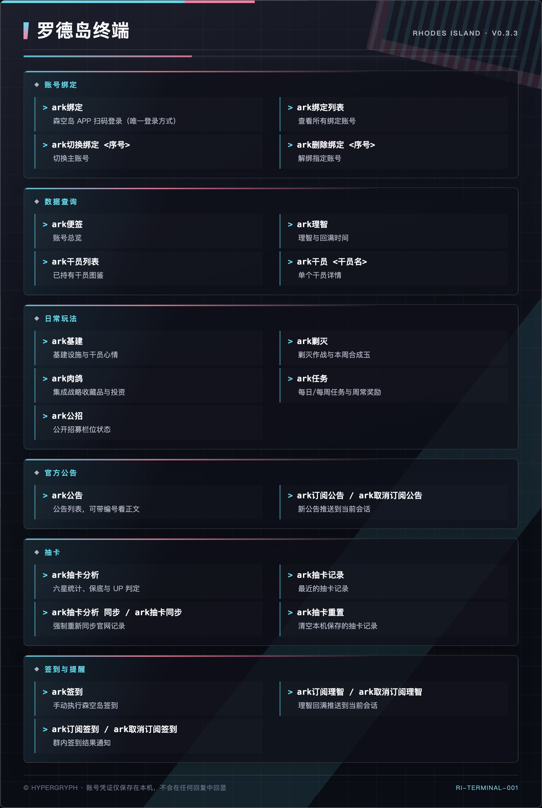

**`ark便签`**

<sub>账号总览</sub>

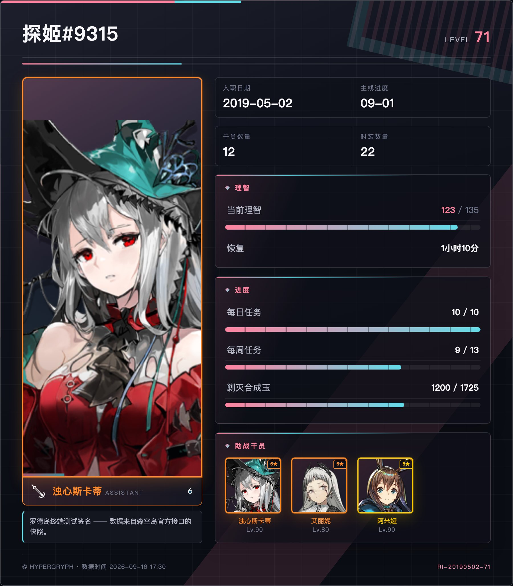

**`ark理智`**

<sub>理智与回满时间</sub>

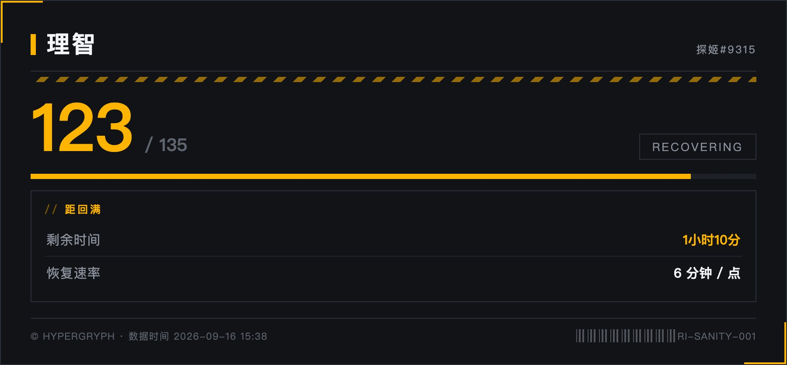

**`ark干员 &lt;名称&gt;`**

<sub>干员详情</sub>

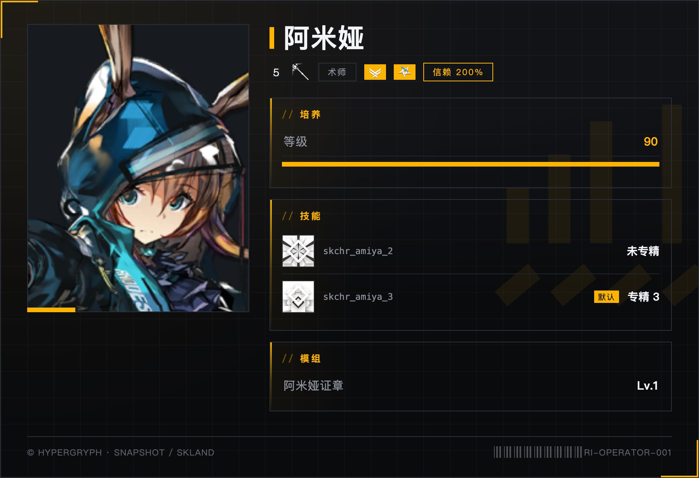

**`ark干员列表`**

<sub>持有干员图鉴</sub>

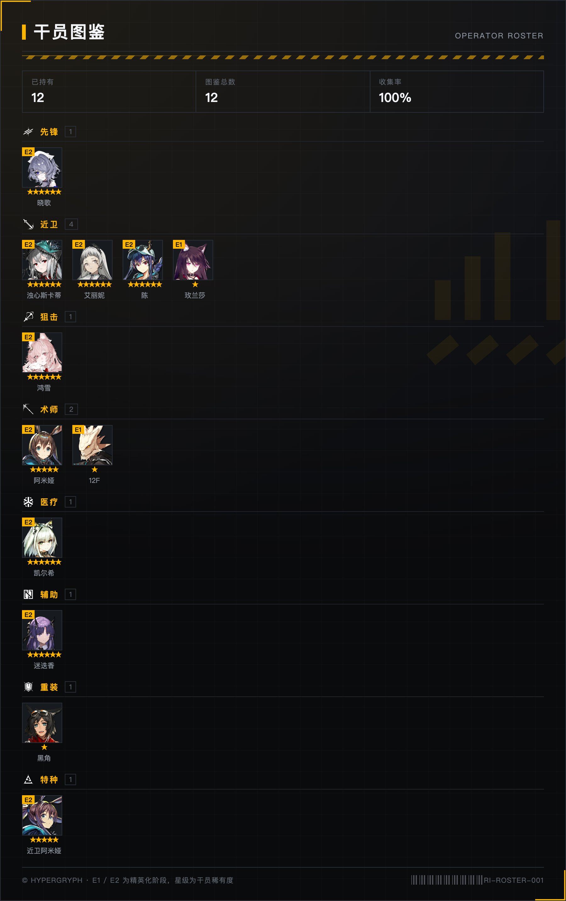

**`ark基建`**

<sub>基建设施与干员心情</sub>

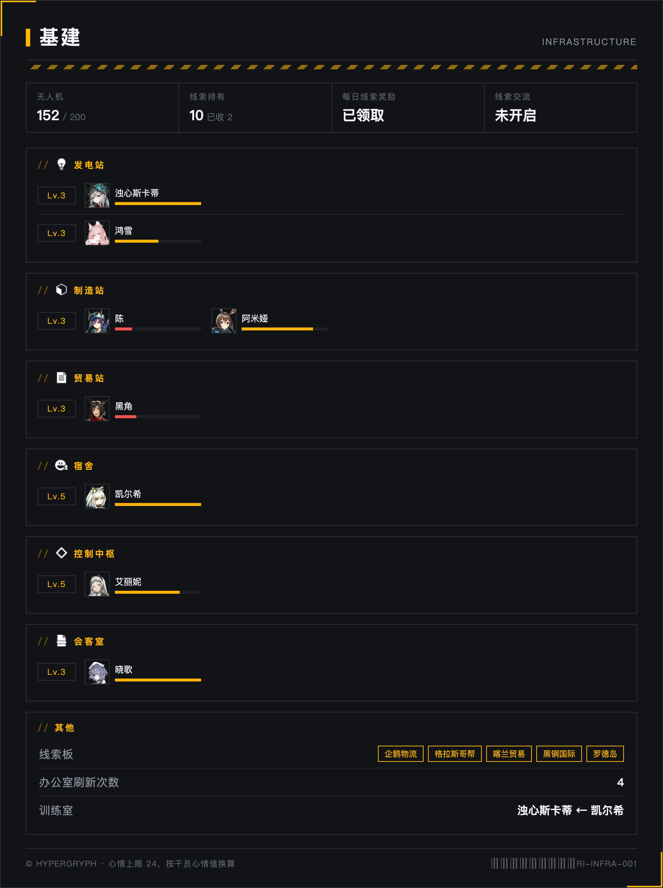

**`ark剿灭`**

<sub>剿灭作战与本周合成玉</sub>

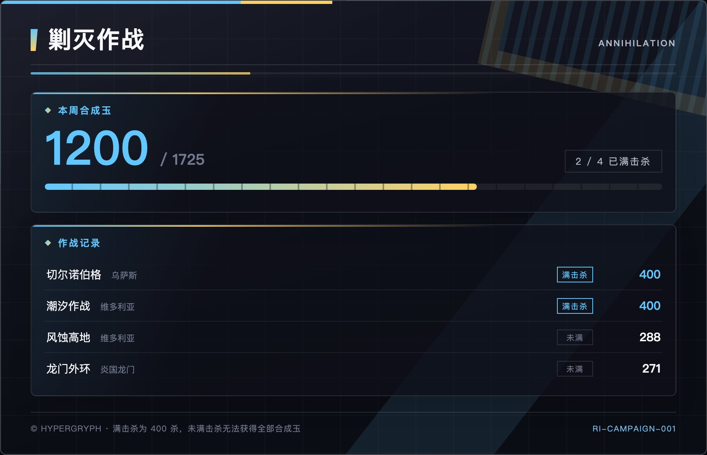

**`ark肉鸽`**

<sub>集成战略收藏品与投资</sub>

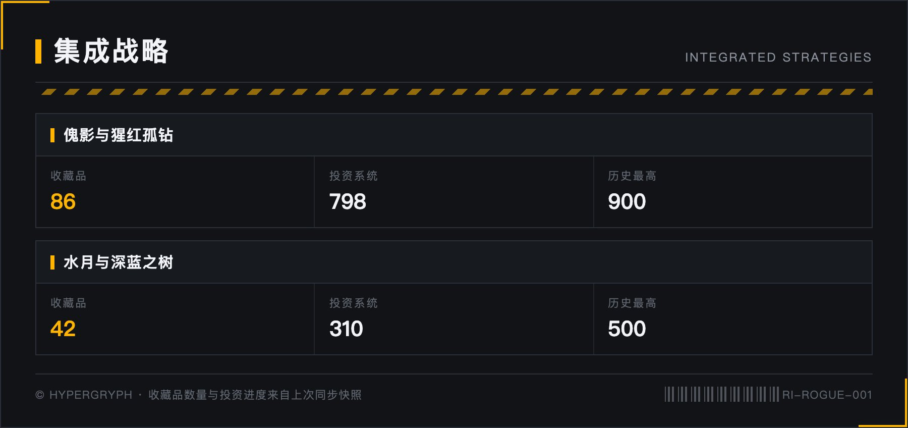

**`ark任务`**

<sub>每日 / 每周任务</sub>

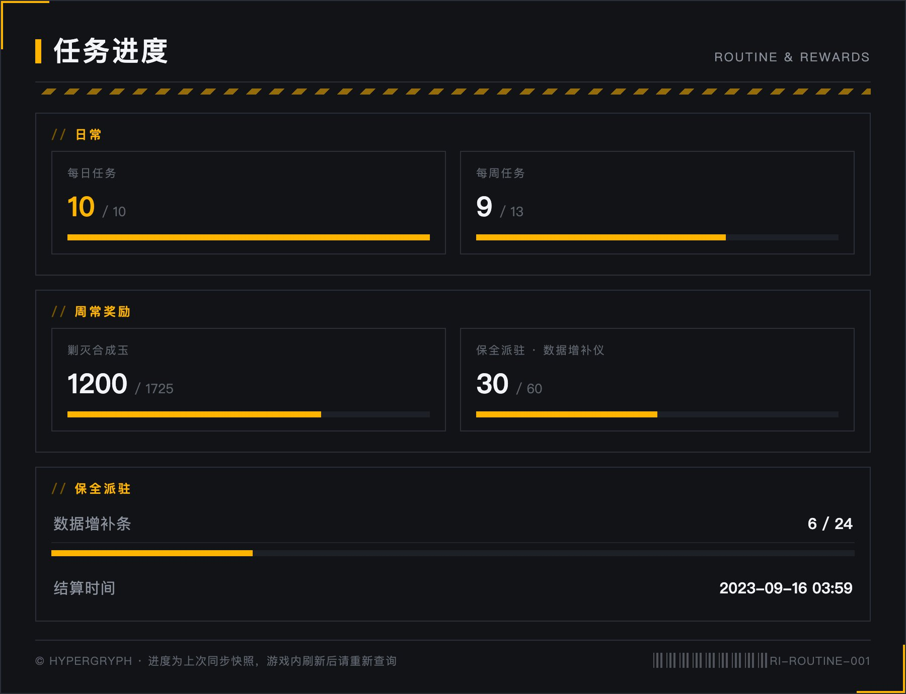

**`ark公招`**

<sub>公开招募栏位</sub>

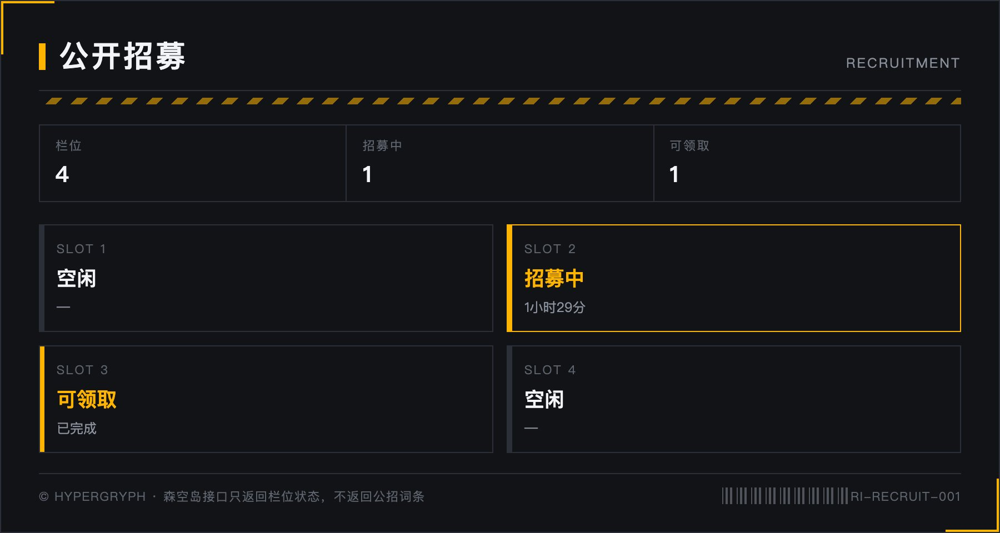

**`ark抽卡分析`**

<sub>六星统计、保底与 UP 判定</sub>

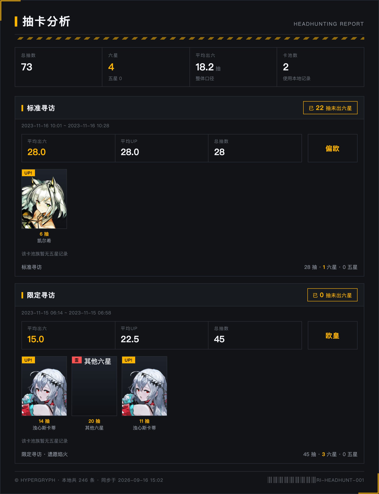

**`ark公告`**

<sub>官方公告列表</sub>

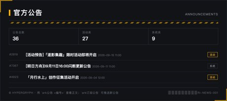

**`ark公告 &lt;编号&gt;`**

<sub>公告详情（保留官方排版与配图）</sub>

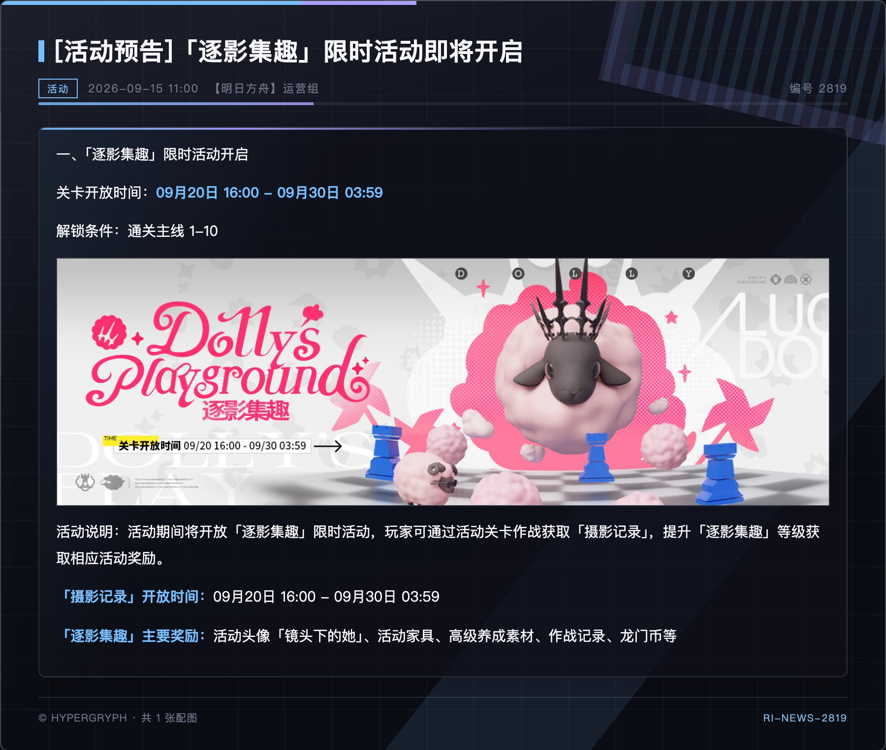

</details>

> 预览图由 `tests/render_preview.py` 一键重新生成：它会用固定测试数据渲染全部 13 张卡片，
> 并把渲染器输出（原生 1800px）直接复制到 `docs/preview/`，**不做任何缩放**——
> 因此预览与机器人实际发送给用户的图片完全一致。UI 设计稿见 `docs/preview/ui-design.png`。

---

## 🎨 自定义美化

卡片模板位于插件目录的 `templates/`，直接用 HTML + CSS 编写，可以自由替换配色与版式：

| 文件 | 对应卡片 |
|:-----|:---------|
| `templates/base.css` | 全局配色与组件样式（`--accent` 控制强调色，默认琥珀 `#FFB400`） |
| `templates/note.html` | 便签 |
| `templates/sanity.html` | 理智 |
| `templates/operator_list.html` / `operator.html` | 干员图鉴 / 干员详情 |
| `templates/building.html` | 基建 |
| `templates/campaign.html` / `rogue.html` / `task.html` / `recruit.html` | 剿灭 / 集成战略 / 任务 / 公招 |
| `templates/gacha.html` | 抽卡分析 |
| `templates/announce.html` | 官方公告 |
| `templates/help.html` | 帮助菜单 |

想改主色调，只改 `base.css` 里的 `--accent` 即可全局生效。

### 卡片背景装饰

卡片底不是纯色，而是**多层 CSS 叠加**（没有任何位图素材，因此仓库零增重、任意 DPI 都锐利、长卡片不会出现平铺接缝）：

| 层 | 内容 | 变量 |
|:---|:---|:---|
| 1 | 徽记水印（内联 SVG，约 600 字节） | `--wm-image` / `--wm-size` / `--wm-pos` |
| 2 | 星空（仅抽卡卡） | `--stars` |
| 3 | 蓝图网格 | `--grid-line` / `--grid-pitch` |
| 4 | 琥珀辉光 | `--glow-color` / `--glow-at` |
| 5 | 暗角 | `--vignette` |

分区还叠了两处细节：`.panel` 左侧的琥珀渐变细边，以及页头下的扫描线。

按卡片主题覆盖变量即可换风格，现有主题：`t-gacha`（星空 + 星形水印）、`t-announce`、`t-building`、`t-rogue`、`t-roster`。
主题类由渲染器**按模板名自动注入**（见 `core/render.py` 的 `CARD_THEMES`），新增卡片只需在模板里写 `class="card {{ card_class }}"`。

> 水印刻意使用**非闭合图形**（信号条 + 危险条纹），因为矩形轮廓在数据区背后会被误读成面板边框。

---

## 📋 TODO

- [x] 账号绑定（扫码）、便签、理智、签到
- [x] 干员图鉴与干员详情
- [x] 基建、剿灭、集成战略、任务、公开招募
- [x] 抽卡记录导入与卡池族分析（UP / 歪判定、保底、欧非评级）
- [x] 官方公告列表、正文与订阅推送
- [ ] 活动与别传进度（`activityInfoMap` + `activity` 已在手）
- [ ] 时装图鉴（`skins` + `skinInfoMap` 已在手）
- [ ] 干员技能名（需 `skill_table.json`）
- [ ] 材料掉率查询（需企鹅物流 API）
- [ ] 卡片装饰性背景素材
- [ ] 公招词条组合推荐（**暂缓**：森空岛接口不返回词条，招募池成员缺少可靠结构化来源，未验证前不做，以免给出错误建议）

---

## 📜 更新日志

<details>
<summary>点击展开版本历史</summary>

### 0.2.0 (2026-09-16)

- 🎨 卡片背景改为多层 CSS 装饰（网格 / 暗角 / 辉光 / 水印 / 分卡主题），无位图素材

- ✨ **抽卡记录本地持久化**：记录累积保存并按 `(类别, 时间, 位置)` 去重合并，新增 `ark抽卡分析 同步` 强制刷新与 `ark抽卡重置` 清空
- ✨ 预览图与设计稿存档于 `docs/preview/`

- ✨ 抽卡分析：官方抽卡记录导入，按卡池族分别统计（平均出六 / 平均 UP / 总抽数 / 当前保底），六星序列、UP / 歪判定与欧非评级
- 🐛 **统计修正**：去重键加入 gacha category（原先跨类别游标相同会丢记录）；UP 名单只取 `upCharInfo`（原先把 `availCharInfo` 当 UP，导致歪恒为 0）；保底与平均改为按卡池族统计（原先跨卡池混算）
- ✨ 日常玩法：基建、剿灭、集成战略、任务、公开招募
- ✨ 官方公告：列表、按编号看正文、新公告订阅推送
- ✨ 便签新增助理立绘、签名、干员数与时装数分列
- 🎨 全部卡片按明日方舟 UI 重绘：近黑底 + 琥珀强调、角标括线、危险条纹、`//` 分区标题
- 🖼️ 接入干员立绘 / 头像、职业徽章、稀有度 / 精英化 / 潜能标记、基建设施图标、时装立绘
- 🔒 指令全部加 `ark` 前缀，与终末地插件互不抢答
- ✨ 漏写 `~` 唤醒前缀时主动提示正确写法

### 0.1.0 (2026-09-16)

- ✨ 首个版本：扫码绑定、便签、理智、签到、干员图鉴与详情、帮助菜单
- ✨ 理智回满推送、群签到通知
- 🎨 Playwright + Jinja2 卡片渲染基座

</details>

---

## 🙏 鸣谢

### 协议实现参考（均为 MIT 许可）

- [astrbot_plugin_skland](https://github.com/Azincc/astrbot_plugin_skland) —— 森空岛设备指纹与请求签名算法的参考实现
- [AstrBot-SenKongDao-Check-in](https://github.com/Twilight719/AstrBot-SenKongDao-Check-in) —— 理智回满外推公式与订阅推送思路

### 产品形态参考

- [astrbot_plugin_endfield](https://github.com/Entropy-Increase-Team/astrbot_plugin_endfield)（**AGPL-3.0**）—— 仅作产品形态与功能设计参考，**本项目未复用其任何代码**
- [astrbot_plugin_mrfz_haunting_query](https://github.com/R1ckyQaQ/astrbot_plugin_mrfz_haunting_query)（**AGPL-3.0**）—— 抽卡记录接口调研参考

> 需要特别说明：终末地插件与抽卡查询插件均为 AGPL-3.0。为保持本项目 MIT 许可，其代码（包括渲染器）均未被复制或移植，相关能力为独立实现。若将来需要复用它们的代码，本项目必须改为 AGPL-3.0 发布。

### 插件图标

`logo.png` 由本插件作者使用 `gpt-image-2.5` 生成（提示词见 `docs/preview/ui-prompt.md`），
为原创抽象图形，不含任何官方角色或素材，可随本项目以 MIT 许可使用。

### 图像资源出处

卡片里的图片全部来自公开的游戏资源镜像，**每一个路径在写进代码前都实测过 HTTP 200**，没有猜测：

| 资源 | 用途 | 来源 |
|---|---|---|
| `torappu.prts.wiki/assets` | 干员头像、精英化立绘、技能图标 | PRTS Wiki 的官方资源镜像 |
| [Aceship/Arknight-Images](https://github.com/Aceship/Arknight-Images) | 职业徽章（`classes/class_*.png`）、稀有度 / 精英化 / 潜能标记（`ui/rank`、`ui/elite`、`ui/potential`）、基建设施图标（`ui/infrastructure`）、时装立绘（`portraits/`）、物品图标（`items/`） | GitHub |
| [yuanyan3060/ArknightsGameResource](https://github.com/yuanyan3060/ArknightsGameResource) | 时装立绘（`skin/`）、物品稀有度框（`item_rarity_img/`）、基建技能图标（`building_skill/`）、游戏数据表（`gamedata/excel/`，用于卡池与 UP 名单） | GitHub |

图片经 `cdn.jsdelivr.net` 的 GitHub 镜像加载（国内可达性优于 `raw.githubusercontent.com`）。

### 数据来源

| 数据 | 来源 |
|---|---|
| 账号、签到、便签、理智、干员、基建、剿灭、集成战略、任务、公招 | 森空岛官方接口 |
| 抽卡记录 | 鹰角官网 `ak.hypergryph.com` |
| 卡池元数据（名称 / 时间 / 规则类型） | `yuanyan3060/ArknightsGameResource` 的 `gacha_table.json` |
| 卡池 UP 名单 | PRTS `weedy.prts.wiki/gacha_table.json` |
| 官方公告 | 官网 `ak.hypergryph.com/news`（列表与正文均从页面解析；原 `ak-conf.hypergryph.com` 的配置自 2025-05 起未再更新，已弃用） |

> 本项目与鹰角网络、PRTS Wiki、上述资源仓库无隶属关系，仅使用其公开资源；如相关方有异议会立即移除。

## 📄 许可

[MIT](LICENSE)


---

## ❓ 常见问题

### Q1: 为什么我的 `扫码绑定` / `理智` / `便签` 没有反应？

因为这些是**终末地插件**的指令，不是本插件的。本插件的指令一律以 `ark` 开头，例如 `ark绑定`、`ark理智`、`ark便签`。发送 `ark帮助` 可看完整菜单。

### Q2: 安装后无法渲染图片？

确认已执行 `playwright install chromium`。渲染失败时插件会降级为文本摘要，不会报错崩掉。

### Q3: 提示凭证失效？

森空岛的登录凭证有有效期。重新执行 `ark绑定` 扫码即可（群聊 / 私聊都可以）。插件检测到凭证失效时会自动清除该绑定。

### Q4: 理智数值和游戏内不一致？

森空岛接口返回的是**上次同步的快照**。插件会用恢复速率（6 分钟/点）从回满时刻反推当前理智，卡片上会标注数据时间。若偏差较大，在森空岛 APP 中同步一次账号即可。

### Q5: 抽卡分析显示「不做 UP / 歪判定」？

部分特殊卡池（定向甄选、中坚 FES、跨年欢庆、归航等）在官方数据里**没有 UP 名单**。这种卡池的所有六星都在池内，没有「歪」的概念，因此插件不做判定而不是猜一个结果。

### Q6: 账号凭证是怎么存的？

保存在 `AstrBot/data/plugin_data/astrbot_plugin_arknights/users.json`，文件权限 `0600`，仅本机可读，且不会在任何回复中回显。

<div align="center">

### 如果喜欢这个插件，别忘了给仓库点个 ⭐

</div>
